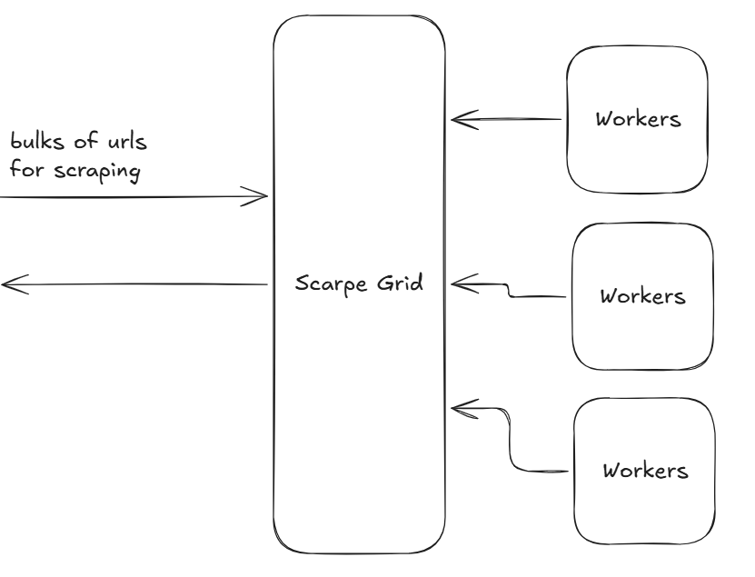
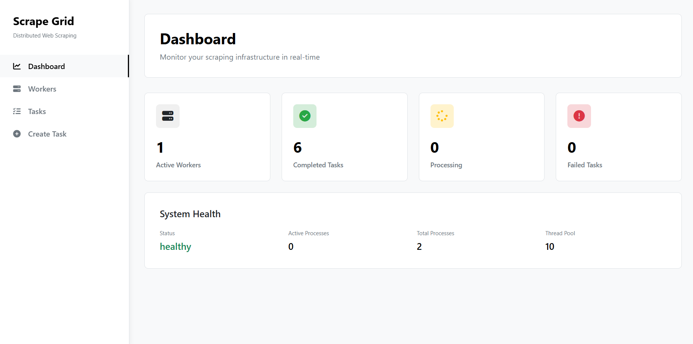
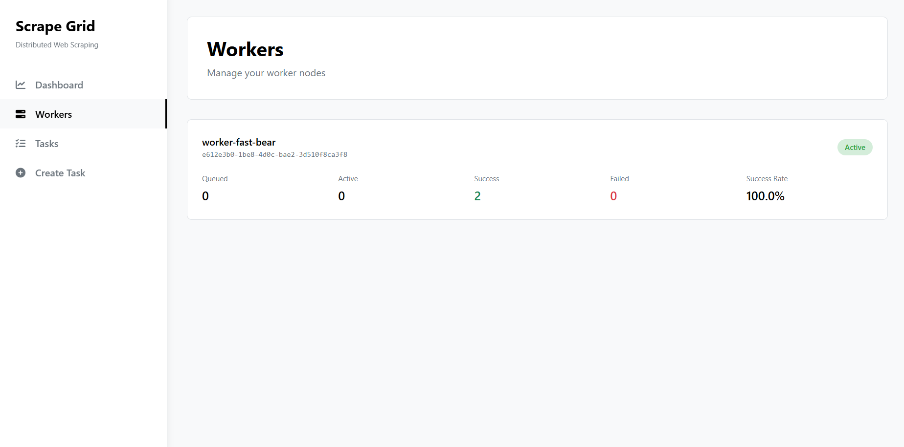
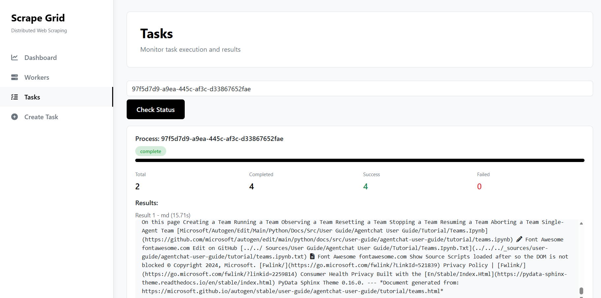
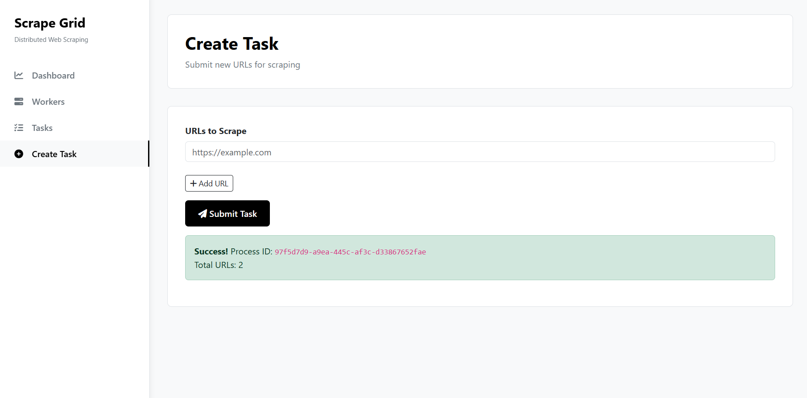

# 🕸️ Scrape Grid

A distributed, scalable web scraping system designed to process bulk URLs efficiently using multiple worker nodes coordinated through a central grid. Built to be extensible, fault-tolerant, and easy to scale horizontally.

## 📌 Overview

Scrape Grid acts as a central coordinator that:

- Accepts large batches of URLs for scraping
- Distributes tasks across multiple workers
- Tracks worker health and task status
- Aggregates results and execution metrics

This architecture allows you to scale scraping workloads simply by adding more workers.

## 🏗 Architecture



### Components

#### 1. Scrape Grid (Core / Controller)

The Scrape Grid is the brain of the system.

**Responsibilities:**
- Accept bulk scraping requests (URLs)
- Queue and assign tasks to available workers
- Monitor worker status (active, idle, failed)
- Collect results and execution metrics
- Handle retries and failures

#### 2. Workers

Workers are independent scraping executors.

**Responsibilities:**
- Pull tasks from Scrape Grid
- Perform scraping (HTTP / Playwright / custom logic)
- Return scraped data and execution stats
- Report health and heartbeat information

Workers are stateless and can be scaled horizontally.

#### 3. Client / Input Source

- Sends bulk URLs to Scrape Grid
- Receives results, status updates, or callbacks

## 🔄 Data Flow

1. **Client** submits a bulk list of URLs
2. **Scrape Grid:**
   - Validates and queues tasks
   - Assigns tasks to available workers
3. **Workers:**
   - Fetch tasks
   - Scrape target pages
   - Send results back
4. **Scrape Grid:**
   - Aggregates results
   - Tracks metrics (success, failure, time)
   - Exposes status via API

## ⚙️ Key Features

- ✅ Distributed scraping
- ✅ Horizontal scalability
- ✅ Worker health monitoring
- ✅ Fault tolerance & retries
- ✅ Supports multiple scraping strategies
- ✅ API-driven architecture
- ✅ Designed for cloud & container environments

## 🧱 Design Principles

- Loose coupling between grid and workers
- Stateless workers for easy scaling
- Asynchronous task handling
- Extensible scraping logic
- Observability first (metrics, logs, status)

## 🚀 Use Cases

- Large-scale web crawling
- Search engine indexing
- Data aggregation & monitoring
- Price tracking
- Content extraction pipelines
- Research & analytics

## Screen Short






## 🛠 Tech Stack

*Actual stack may vary depending on implementation*

- Python (FastAPI / AsyncIO)
- Playwright
- Queue system
- Docker
- REST

## 📦 Getting Started

```bash
# Clone repository
git clone https://github.com/anshjoseph/Scrape-Grid
cd scrape-grid
```

Setup instructions for Grid and Workers are documented in their respective directories.

## 🤝 Contributing

Contributions are welcome!

- Fork the repository
- Create a feature branch
- Submit a Merge Request (MR)
- Follow coding and commit guidelines

Please ensure:
- Clear commit messages
- Proper documentation
- Tests where applicable

## 📄 License

This project is open source and licensed under the MIT License.

## 🌟 Future Improvements

- Rate-limit aware scheduling
- Auto-scaling workers
- Distributed storage backend
- UI dashboard
- Plugin-based scraper modules

---

**Made with ❤️ by the Scrape Grid team**